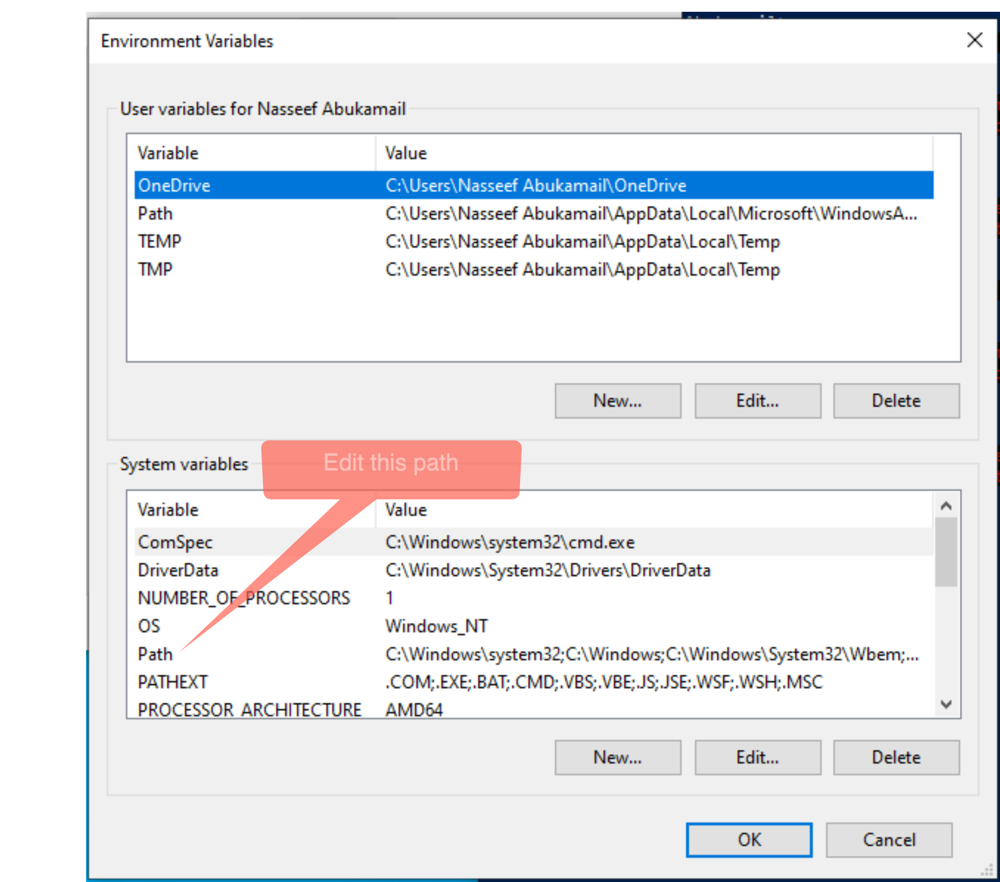

## Installing minGW-64 C/C++ compiler on Windows
### Contact: Nasseef Abukamail (abukamai@ohio.edu)

1. Download [MinGW-64](https://sourceforge.net/projects/mingw-w64/files/mingw-w64/). Download the file `MinGW-W64-install.exe`
2. Run the installer and select all the default values
3. Edit the system environment variables under settings (Search for `Settings: Edit Environment variables`)
4. Select `Edit System Environment Variables`. You should see the following screen:
   
   
5. If you have an older version of MinGW, remove any path that references it.
   
6. Under system variables (bottom section), click on the `Path` variable, click `Edit`, then `New`, and add the the following path:
    ```console
    C:\Program Files (x86)\mingw-w64\i686-8.1.0-posix-dwarf-rt_v6-rev0\mingw32\bin
    ```

7. Click `OK` on all the dialog boxes to save the changes.

8.  Restart your terminal and `VSCode` for the changes to take effect.
9.  To verify that the installation is complete, open `PowerShell` and type the command `g++ --version` you should see a reference to `MinGW-W64 project`.
   
    